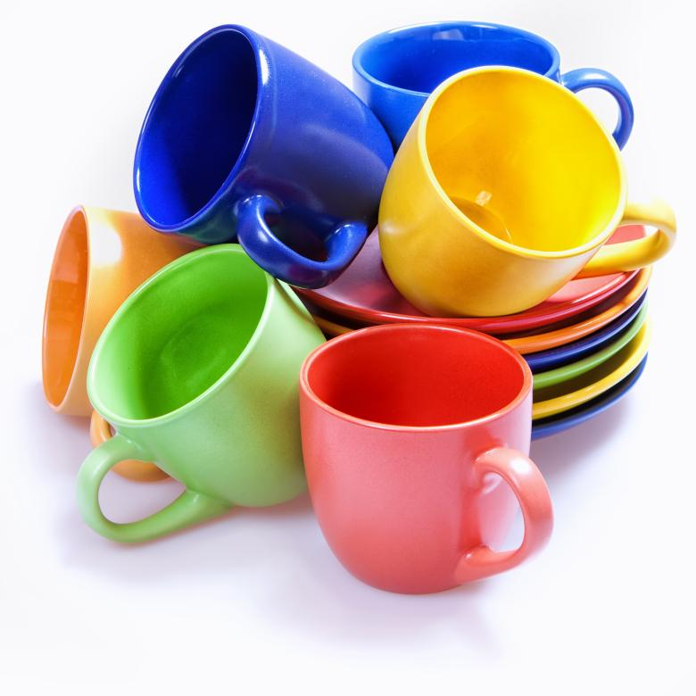

<html lang="en">
<head>
  <meta charset="UTF-8">
  <meta name="viewport" content="width=device-width, initial-scale=1.0">
  <title>Beginner HTML Page</title>
  <link rel="stylesheet" href="https://use.typekit.net/txt4pqn.css"> 
  
</head>
<body>

  <h1 class="canvas">This is a page about cups</h1>

  
We use cups all the time; as humans, we have had cups around for our entire existence. Fun, right? Did you know that the oldest cups ever found are actually made from skull caps!!
    It leaves to question though what and where these skulls came from though.
  

  
There are many types of cups. Mugs, Coffee Cups, Teacups, Paper cups

  <h2>
    

      See, here are some more cups... Colorful, right?
    

  </h2>

  

  

    <button>Dropdown</button>
    

      
Dropdown Content Here

    

  

</body>
</html>

</body>
</html>

